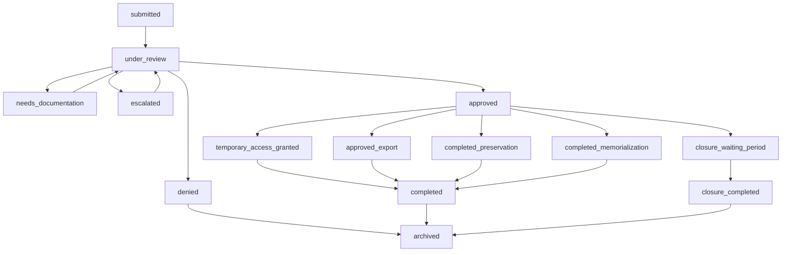
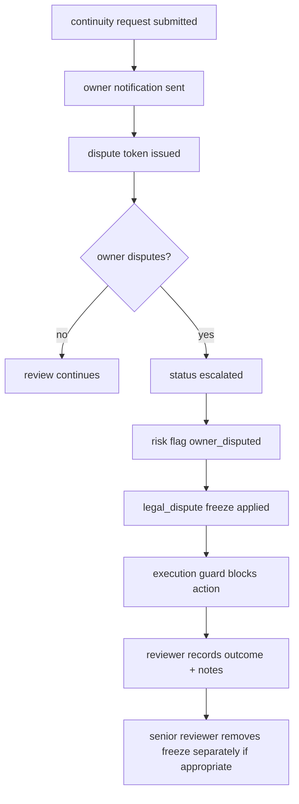

# Asset Safe Continuity & Legacy Operations

Status: launch review draft
Owner: Asset Safe operator / continuity reviewer
Scope: Legacy Admin requests, Recovery Delegates, continuity review, owner disputes, account freezes, exports, preservation, memorialization, and continuity closure.

## 1. Operating Principles

1. Continuity actions are manual-review actions. No ownership transfer, export, preservation, memorialization, or closure should execute solely because a Legacy Admin submits a request.
2. Account owner protection comes first. Owner notifications, dispute links, waiting periods, account freezes, and audit logs are safety controls, not optional decoration.
3. The account should remain reversible until the final continuity action is executed. Preservation, temporary access, export authorization, and closure waiting periods must leave a review trail.
4. Continuity records are retained as legal/security evidence. They should not be swept by ordinary account-deletion cleanup unless explicitly anonymized through the deletion/tombstone policy.

## 2. Primary Roles

| Role | Current system surface | Operational meaning |
|---|---|---|
| Account owner | Account, Legacy Locker, continuity preferences, dispute link | Person whose account may be preserved, exported, memorialized, or closed |
| Legacy Admin | Existing authorized user designated in `legacy_admins` as primary or secondary | Can submit continuity requests for the assigned account; secondary designation does not change normal Authorized User permissions |
| Recovery Delegate | `legacy_locker.delegate_user_id` and recovery request flow | Can request encrypted Legacy Locker recovery after owner grace period |
| Continuity reviewer | Admin Continuity & Preservation workspace | Reviews identity, legal authority, evidence, risk, owner response, and requested action |
| Senior reviewer | Admin roles with freeze/temp-access/preservation authority | Can approve high-impact continuity actions |
| Ownership administrator | Admin/owner role | Can execute final continuity actions where allowed |

## 3. Current Request Surfaces

### 3.1 Legacy Admin continuity request

User-facing component: `ContinuityRequestWizard`

Legacy Admin designation policy:

- Each account may have one active primary Legacy Admin.
- Each account may have additional active secondary Legacy Admins as backups.
- Adding or removing a Legacy Admin designation does not change billing, deletion, owner-profile, or Authorized User access permissions.
- Multiple active continuity requests still require reviewer conflict resolution before high-impact actions execute.

Request types:

- `temporary_assistance`
- `data_export`
- `preservation`
- `memorialization`
- `account_closure`
- Historical/legacy: `ownership_transfer`, `closure`, `export`

Captured requester metadata:

- Relationship to account holder.
- Legal authorization answer: yes/no/unsure.
- Whether the owner has passed away: yes/no/unsure.
- Narrative situation, minimum 20 characters.
- Requested outcomes.
- Optional supporting documents in `continuity-documents`.

Admin workspace:

- Request Queue.
- Active Reviews.
- External Assistance.
- Temporary Continuity Access.
- Continuity Actions.
- Denied.
- Archived.
- Audit Log.

### 3.2 Recovery Delegate request

Core tables/functionality:

- `recovery_requests`
- `legacy_locker.delegate_user_id`
- `legacy_locker.recovery_grace_period_days`
- `submit-recovery-request`
- `respond-recovery-request`
- `check-grace-period-expiry`

Current behavior:

- Delegate submits a recovery request.
- Owner has a configured grace window, usually 7-30 days.
- Owner can approve/reject during grace.
- Sweeper processes expired recovery grace.

Launch note:

- Recovery Delegate flow is distinct from Legacy Admin continuity review. Recovery unlocks encrypted Legacy Locker material; it should not imply broader account ownership or billing authority.

## 4. Evidence & Verification

### 4.1 Evidence currently supported

Document categories:

- Death certificate.
- Power of attorney.
- Trust documentation.
- Letters testamentary.
- Guardianship paperwork.
- Physician statement.
- Government ID.
- Other supporting documentation.

Checklist categories:

- Legacy Admin Identity.
- Legal Authority.
- Account Safety.

Document verification states:

- `unreviewed`
- `verified`
- `rejected`
- `requires_clarification`
- `suspicious`

### 4.2 Recommended default evidence policy

| Request type | Minimum evidence before approval | Senior review |
|---|---|---|
| Temporary continuity access | Legacy Admin identity + relationship + reason + no active owner dispute | Required if access includes download/export |
| Data export | Identity + legal authority or executor documentation + explicit export scope | Required |
| Preservation | Identity + credible incapacity/death/legal basis + no active dispute | Required |
| Memorialization | Identity + death evidence or comparable legal/family proof | Required |
| Account closure | Identity + legal authority + death/incapacity/estate proof + 30-day waiting period | Required |

The default evidence matrix is seeded in `continuity_evidence_requirements` and surfaced in the case checklist as required, conditional, or recommended for each request type.

Open legal question:

- Whether plaintext copies of death certificates and legal documents are retained indefinitely, retained for a fixed review window, or replaced by reviewed metadata plus restricted storage object retention.

### 4.3 Competing request conflict policy

When more than one active continuity request exists for the same account, the system marks each active case as `potential_conflict`, records the related request IDs, raises the risk posture, and blocks execution through `enforce_continuity_execution_guard`.

Default reviewer policy:

- Treat all competing requests as elevated risk until reviewed.
- Compare requester authority, owner preferences, submitted evidence, request type, and timeline.
- Do not approve export, temporary access, preservation, closure, memorialization, or ownership transfer until the conflict is resolved on the case.
- Record conflict resolution notes explaining why the selected case may proceed or why the request should be denied/paused.

## 5. State Machines

### 5.1 Continuity request review

### 5.2 Owner dispute / freeze

Execution guard blocks final action when:

- Owner dispute status is `disputed`.
- Continuity freeze status is `active`.
- Waiting period has not elapsed and was not bypassed.

Owner dispute operating policy:

- Owner-submitted disputes automatically apply a `legal_dispute` account freeze when one is not already active for the case.
- Resolving the dispute requires reviewer outcome selection and internal resolution notes.
- Dispute resolution does not remove the freeze. Freeze removal remains a separate senior-review action with its own reason.

## 6. Core Tables

| Table | Purpose |
|---|---|
| `account_continuity_requests` | Main continuity review queue |
| `continuity_documents` | Supporting documentation metadata |
| `continuity_checklist_items` | Per-case verification checklist |
| `continuity_notes` | Internal review notes |
| `continuity_messages` | Reviewer/requester messages |
| `continuity_timeline_events` | Case timeline |
| `continuity_audit_logs` | Audit log for continuity actions |
| `continuity_owner_notifications` | Owner notice tracking |
| `continuity_owner_dispute_tokens` | Owner dispute links |
| `continuity_account_freezes` | Account/request freezes |
| `continuity_account_snapshots` | Pre-action snapshots |
| `continuity_execution_events` | Final action execution log |
| `continuity_temporary_access` | Time-bound continuity access |
| `continuity_archive_custodian_access` | Archive/preservation access |
| `continuity_export_authorizations` | Time-bound export grants |
| `continuity_export_forensics` | Export forensic record |
| `memorialized_accounts` | Memorialized account end-state |
| `closure_requests` | Continuity closure workflow |
| `recovery_requests` | Recovery Delegate encrypted-vault recovery |

## 7. Current Edge Functions & RPCs

Edge functions:

- `notify-continuity-request`
- `dispatch-continuity-event`
- `send-continuity-notification`
- `send-legacy-admin-notification`
- `submit-recovery-request`
- `respond-recovery-request`
- `send-recovery-request-email`
- `send-recovery-approved-email`
- `send-recovery-rejected-email`
- `acknowledge-delegate-access`
- `send-delegate-access-email`

Key RPCs:

- `submit_continuity_dispute`
- `apply_account_freeze`
- `remove_account_freeze`
- `set_memorialized_mode`
- `bypass_waiting_period`
- `compute_continuity_readiness`
- `enforce_continuity_execution_guard`
- `create_continuity_snapshot`
- `revoke_continuity_access`
- `approve_closure_request`
- `complete_closure`
- `cancel_closure`
- `authorize_continuity_export`
- `consume_continuity_export_authorization`
- `expire_continuity_export_authorizations`
- `get_continuity_ops_report`

## 8. Operational SLAs

Recommended default SLAs:

| Work item | SLA | Owner |
|---|---:|---|
| New continuity request triage | 1 business day | Continuity reviewer |
| Additional documentation request | 2 business days | Continuity reviewer |
| High-risk / owner-disputed request | same business day | Senior reviewer |
| Temporary access decision | 2 business days after evidence complete | Senior reviewer |
| Export authorization decision | 3 business days after evidence complete | Senior reviewer |
| Closure waiting period | 30 calendar days unless legally bypassed | Ownership administrator |
| Recovery Delegate owner grace | owner-configured 7-30 days | Automated sweeper + owner response |

Owner heartbeat policy:

- Owner heartbeat is optional and owner-configured from Continuity Preferences.
- Supported cadences are 30, 60, 90, 180, or 365 days.
- A missed heartbeat is an admin-review signal only. It does not automatically trigger continuity, grant access, export data, memorialize, preserve, close, or transfer an account.
- Heartbeat due/overdue cases are available through `get_continuity_heartbeat_report`.

## 9. Launch Gaps

### P0 before launch

1. Competing continuity requests are detected on `account_continuity_requests`, surfaced in the admin queue, and blocked from execution until reviewer resolution notes are recorded.
2. Continuity review SLA clock exists on `account_continuity_requests`; Request Queue and Active Reviews surface overdue, due-soon, and disputed cases.
3. Owner disputes automatically apply a legal-dispute freeze, require reviewer outcome notes to resolve, and require separate senior-review freeze removal.
4. Default evidence requirements are seeded in `continuity_evidence_requirements` and surfaced in the case checklist by request type.

### P1 first 30 days

5. Optional owner heartbeat policy exists on `legacy_locker`; missed check-ins are review signals only and do not trigger continuity actions automatically.
6. In-app ops reporting exists for unresolved owner disputes, external assistance backlog age, high-risk external assistance, and overdue continuity reviews.
7. Secondary Legacy Admin UX is implemented: `legacy_admins` supports active primary/secondary designations with one active primary per account.

### P2 quarter 1

8. Add continuity incident tabletop: disputed death report, competing executor requests, fraudulent documentation, and owner account recovery after freeze.
9. Formal evidence retention workflow exists for uploaded death/legal documents: reviewers can classify retention category, expiration, legal hold, status, and notes on each `continuity_documents` row.
10. Add operational metrics: median triage time, review backlog, dispute aging, and closure waiting-period completion rate.

## 10. Open Questions

1. Should owner dispute resolution for export, closure, and ownership transfer require second-reviewer signoff before freeze removal?
2. Should conflict resolution require a second reviewer for ownership transfer, closure, or export cases?
3. Should missed owner heartbeats generate email reminders or remain admin-review signals only?
4. Which seeded evidence requirements need counsel-approved wording or second-reviewer signoff before launch?
5. Who is allowed to bypass the 30-day continuity closure waiting period, and what evidence is mandatory?
