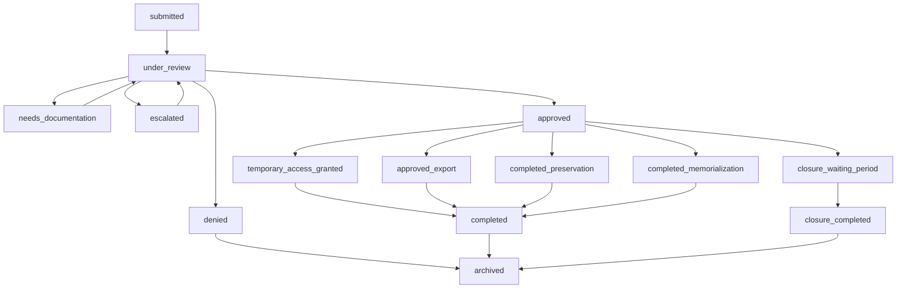
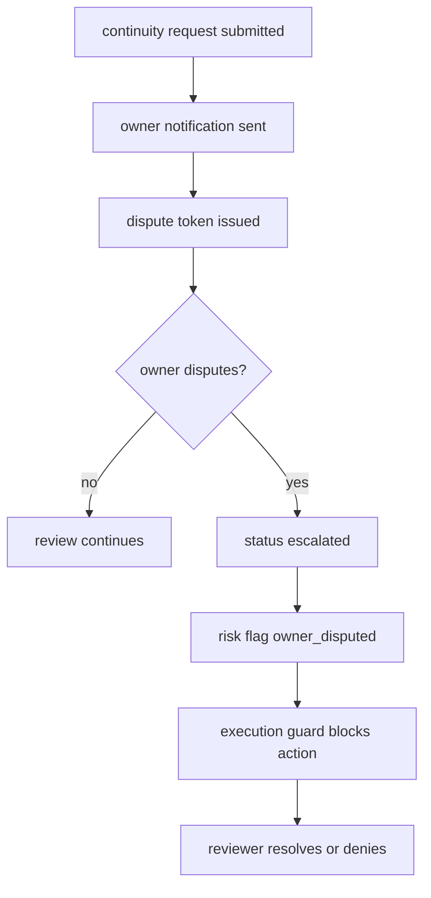

# Asset Safe Continuity & Legacy Operations

Status: launch review draft
Owner: Asset Safe operator / continuity reviewer
Scope: Legacy Admin requests, Recovery Delegates, continuity review, owner disputes, account freezes, exports, preservation, memorialization, and continuity closure.

## 1. Operating Principles

1. Continuity actions are manual-review actions. No ownership transfer, export, preservation, memorialization, or closure should execute solely because a Legacy Admin submits a request.
2. Account owner protection comes first. Owner notifications, dispute links, waiting periods, account freezes, and audit logs are safety controls, not optional decoration.
3. The account should remain reversible until the final continuity action is executed. Preservation, temporary access, export authorization, and closure waiting periods must leave a review trail.
4. Continuity records are retained as legal/security evidence. They should not be swept by ordinary account-deletion cleanup unless explicitly anonymized through the deletion/tombstone policy.

## 2. Primary Roles

| Role | Current system surface | Operational meaning |
|---|---|---|
| Account owner | Account, Legacy Locker, continuity preferences, dispute link | Person whose account may be preserved, exported, memorialized, or closed |
| Legacy Admin | Existing authorized user designated in `legacy_admins` | Can submit continuity requests for the assigned account |
| Recovery Delegate | `legacy_locker.delegate_user_id` and recovery request flow | Can request encrypted Legacy Locker recovery after owner grace period |
| Continuity reviewer | Admin Continuity & Preservation workspace | Reviews identity, legal authority, evidence, risk, owner response, and requested action |
| Senior reviewer | Admin roles with freeze/temp-access/preservation authority | Can approve high-impact continuity actions |
| Ownership administrator | Admin/owner role | Can execute final continuity actions where allowed |

## 3. Current Request Surfaces

### 3.1 Legacy Admin continuity request

User-facing component: `ContinuityRequestWizard`

Request types:

- `temporary_assistance`
- `data_export`
- `preservation`
- `memorialization`
- `account_closure`
- Historical/legacy: `ownership_transfer`, `closure`, `export`

Captured requester metadata:

- Relationship to account holder.
- Legal authorization answer: yes/no/unsure.
- Whether the owner has passed away: yes/no/unsure.
- Narrative situation, minimum 20 characters.
- Requested outcomes.
- Optional supporting documents in `continuity-documents`.

Admin workspace:

- Request Queue.
- Active Reviews.
- External Assistance.
- Temporary Continuity Access.
- Continuity Actions.
- Denied.
- Archived.
- Audit Log.

### 3.2 Recovery Delegate request

Core tables/functionality:

- `recovery_requests`
- `legacy_locker.delegate_user_id`
- `legacy_locker.recovery_grace_period_days`
- `submit-recovery-request`
- `respond-recovery-request`
- `check-grace-period-expiry`

Current behavior:

- Delegate submits a recovery request.
- Owner has a configured grace window, usually 7-30 days.
- Owner can approve/reject during grace.
- Sweeper processes expired recovery grace.

Launch note:

- Recovery Delegate flow is distinct from Legacy Admin continuity review. Recovery unlocks encrypted Legacy Locker material; it should not imply broader account ownership or billing authority.

## 4. Evidence & Verification

### 4.1 Evidence currently supported

Document categories:

- Death certificate.
- Power of attorney.
- Trust documentation.
- Letters testamentary.
- Guardianship paperwork.
- Physician statement.
- Government ID.
- Other supporting documentation.

Checklist categories:

- Legacy Admin Identity.
- Legal Authority.
- Account Safety.

Document verification states:

- `unreviewed`
- `verified`
- `rejected`
- `requires_clarification`
- `suspicious`

### 4.2 Recommended default evidence policy

| Request type | Minimum evidence before approval | Senior review |
|---|---|---|
| Temporary continuity access | Legacy Admin identity + relationship + reason + no active owner dispute | Required if access includes download/export |
| Data export | Identity + legal authority or executor documentation + explicit export scope | Required |
| Preservation | Identity + credible incapacity/death/legal basis + no active dispute | Required |
| Memorialization | Identity + death evidence or comparable legal/family proof | Required |
| Account closure | Identity + legal authority + death/incapacity/estate proof + 30-day waiting period | Required |

Open legal question:

- Whether plaintext copies of death certificates and legal documents are retained indefinitely, retained for a fixed review window, or replaced by reviewed metadata plus restricted storage object retention.

## 5. State Machines

### 5.1 Continuity request review

### 5.2 Owner dispute / freeze

Execution guard blocks final action when:

- Owner dispute status is `disputed`.
- Continuity freeze status is `active`.
- Waiting period has not elapsed and was not bypassed.

## 6. Core Tables

| Table | Purpose |
|---|---|
| `account_continuity_requests` | Main continuity review queue |
| `continuity_documents` | Supporting documentation metadata |
| `continuity_checklist_items` | Per-case verification checklist |
| `continuity_notes` | Internal review notes |
| `continuity_messages` | Reviewer/requester messages |
| `continuity_timeline_events` | Case timeline |
| `continuity_audit_logs` | Audit log for continuity actions |
| `continuity_owner_notifications` | Owner notice tracking |
| `continuity_owner_dispute_tokens` | Owner dispute links |
| `continuity_account_freezes` | Account/request freezes |
| `continuity_account_snapshots` | Pre-action snapshots |
| `continuity_execution_events` | Final action execution log |
| `continuity_temporary_access` | Time-bound continuity access |
| `continuity_archive_custodian_access` | Archive/preservation access |
| `continuity_export_authorizations` | Time-bound export grants |
| `continuity_export_forensics` | Export forensic record |
| `memorialized_accounts` | Memorialized account end-state |
| `closure_requests` | Continuity closure workflow |
| `recovery_requests` | Recovery Delegate encrypted-vault recovery |

## 7. Current Edge Functions & RPCs

Edge functions:

- `notify-continuity-request`
- `dispatch-continuity-event`
- `send-continuity-notification`
- `send-legacy-admin-notification`
- `submit-recovery-request`
- `respond-recovery-request`
- `send-recovery-request-email`
- `send-recovery-approved-email`
- `send-recovery-rejected-email`
- `acknowledge-delegate-access`
- `send-delegate-access-email`

Key RPCs:

- `submit_continuity_dispute`
- `apply_account_freeze`
- `remove_account_freeze`
- `set_memorialized_mode`
- `bypass_waiting_period`
- `compute_continuity_readiness`
- `enforce_continuity_execution_guard`
- `create_continuity_snapshot`
- `revoke_continuity_access`
- `approve_closure_request`
- `complete_closure`
- `cancel_closure`
- `authorize_continuity_export`
- `consume_continuity_export_authorization`
- `expire_continuity_export_authorizations`

## 8. Operational SLAs

Recommended default SLAs:

| Work item | SLA | Owner |
|---|---:|---|
| New continuity request triage | 1 business day | Continuity reviewer |
| Additional documentation request | 2 business days | Continuity reviewer |
| High-risk / owner-disputed request | same business day | Senior reviewer |
| Temporary access decision | 2 business days after evidence complete | Senior reviewer |
| Export authorization decision | 3 business days after evidence complete | Senior reviewer |
| Closure waiting period | 30 calendar days unless legally bypassed | Ownership administrator |
| Recovery Delegate owner grace | owner-configured 7-30 days | Automated sweeper + owner response |

## 9. Launch Gaps

### P0 before launch

1. Document and enforce a conflict policy when multiple Legacy Admins, secondary Legacy Admins, or delegates submit competing continuity/recovery requests.
2. Add an explicit continuity review SLA clock to admin queues so overdue requests and owner disputes surface without manual counting.
3. Confirm owner dispute queue handling: who reviews, what statuses resolve a dispute, and whether a freeze is always applied on dispute.
4. Confirm proof requirements for death/incapacity/authority with counsel or owner sign-off.

### P1 first 30 days

5. Add owner heartbeat / inactivity detection policy if Asset Safe wants continuity to trigger from inactivity rather than only requester-submitted evidence.
6. Add recurring reporting for unresolved continuity disputes and cases waiting on external assistance.
7. Add secondary Legacy Admin UX if the schema is intended for production use.

### P2 quarter 1

8. Add continuity incident tabletop: disputed death report, competing executor requests, fraudulent documentation, and owner account recovery after freeze.
9. Add formal evidence retention workflow for uploaded death/legal documents.
10. Add operational metrics: median triage time, review backlog, dispute aging, and closure waiting-period completion rate.

## 10. Open Questions

1. Should an owner dispute automatically apply an account freeze, or should it only block execution through the guard?
2. What is the exact conflict winner policy for multiple authorized continuity actors?
3. Does Asset Safe want inactivity-triggered continuity, or only request/evidence-triggered continuity?
4. Which documents are required for each request type before approval?
5. Who is allowed to bypass the 30-day continuity closure waiting period, and what evidence is mandatory?
